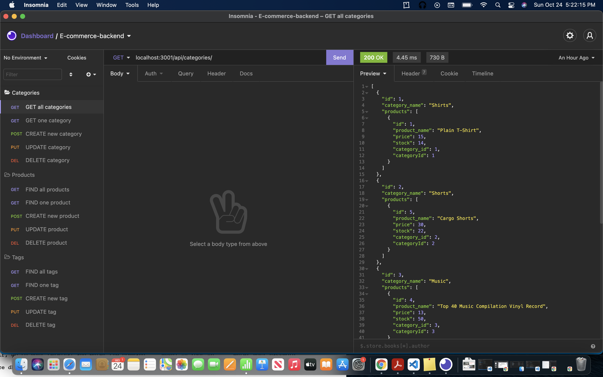

# E-Commerce-Backend Project

## Description
This application is a good example of something oyu would see in the backend. Sequelize is the main node.js that is used for the application. This application uses CRUD (Create, Read, Update, and Delete) to interact with the different databases. ORM, or Object-Rational Mapping, is helpful in creating a complex database, which is essential for most applications, and databases to help developers grow. 

For instructions with CRUD with the application, you can follow this video.

https://drive.google.com/file/d/1jrKsXsurJGUGyQ9bOHFsbGvozdYThkVm/view

And for more questions, please use the contact information below. 

## Table of Contents

* [Installation](#installation)
* [Usage](#usage)
* [License](#license)
* [Technology](#technology)
* [Credits](#credits)
* [Contact](#contact)

## Installation

To install this application you must have a few things on your computer already installed. Node.js and MySql should be on the computer to make sure the software is ready to run the app. Once these are installed, you can follow along for more specific instructions from the video that is above.

1. At the repo for this project, click on the green button. 

2. Click on the SSH Key and copy the link to be used later. 

3. Create a new folder on your desktop.

4. Open up Terminal.

5. Navigate to the new folder on the desktop and type in "git clone" and paste the link that was copied from teh Github repo.

6. Go into the folder and go into the folder that was cloned from teh repo.

7. When you are there, type in "npm install" to install the dependencies that are needed for the project. 

8. While are you are in the root folder, type in "mysql -u root -p", where it will take you to to insert your password. 

9. When you have entered in the beginning of the Terminal will have mysql and then you can type in "source db/schema.sql". This wording will allow the user to create a the database "ecommerce_db" and the tables that correspond with the database. 

9. In order for the database to correctly interact with the server, you have to navigate to the ".env" file and make sure the password is you MySql password. 

10. Then type "quit" to leave MySql. 

11. Type in "npm run seed" in the terminal and that will populate the database with table and rows. 

For more specific instructions, please reach out to me with questions with the links below!

## Usage

To use the application

1. Open the root folder of the repo with Terminal or Git bash. 

2. This root folder is "E-Commerce-Backend-Project". 

3. Run the command "npm start". This will create a message tha the local server is working on port 3001. 

4. Go to an API client that you have installed on your computer. For myself I use Insomnia. 

5. Open up the API client and make different API requests. The endpoints that are used for this application are "api/categories", "api/products", and "api/tags". As explained in the video, you can use different CRUD (Create, Read, Update, and Delete) to test out the different endpoints. 

6. For instructions on CRUD with the endpoints, follow along with the great video posted above!

VIDEO LINK

## License

MIT License 

## Technology

* Sequelize
* SQL
* Javascript
* Node.js

## Credits

* https://github.com/coding-boot-camp/fantastic-umbrella
* UCONN CODING BOOTCAMP

## Contact

- [Github](https://github.com/smurphy7326)
- [Email](mailto:smurphy7326@gmail.com)

